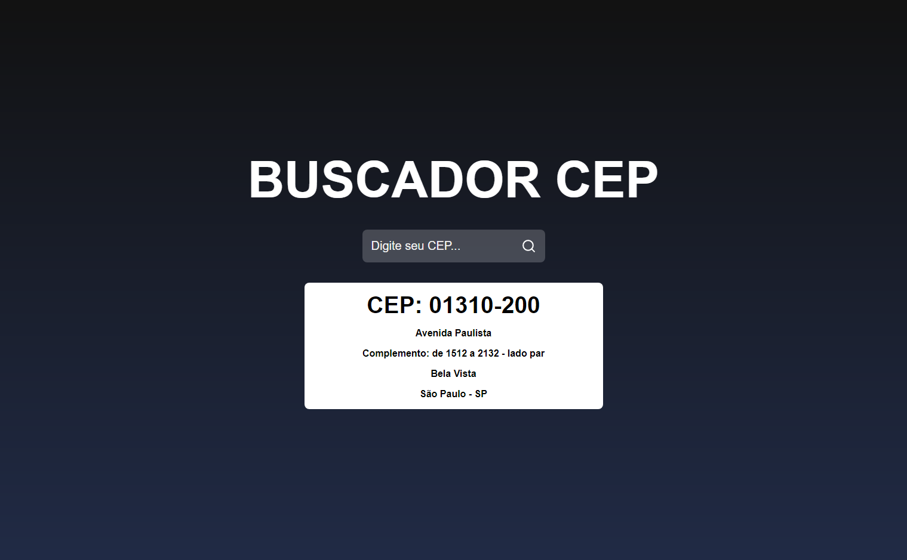

# Buscador de CEP 📍

Project based on Sujeito Programador's Youtube video. The pupose of the video is making a project called "Buscador de CEP" utilizing React to study some of the concepts and practice the library.

💻 After cloning the repository, it's necessary to run npm install on the project directory. Then, just run npm run start to serve locally.

🔗 Links: 
Youtube: https://youtu.be/oy4cbqE1_qc

